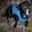
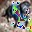

# Dog-to-Cat Adversarial Attack using Gradient Ascent

## Project Description
This implementation generates adversarial examples to fool a CNN classifier into misclassifying dog images as cats. The attack uses gradient-based optimization to perturb input images while maintaining visual similarity to humans.

## Target Misclassification
- **Original Class:** Dog (class index varies - ensure model compatibility)
- **Target Class:** Cat (hardcoded to index 3)
- **Success Condition:** Model predicts class 3 (cat) for dog input

## Key Components
- Pre-trained CNN classifier (10-class model)
- Adversarial optimization with:
  - SGD optimizer (lr=0.01)
  - CrossEntropy loss
  - 10 maximum iterations
  - Early stopping on success
- Input/Output:
  - Input: `correct_image.jpg` (dog image)
  - Output: `fooling_image.jpg` (adversarial example)

## Requirements
- `best_model_dict.pt` (pre-trained weights)
- Python 3.x with:
  - PyTorch
  - OpenCV
  - torchvision
  - NumPy

## Usage
1. Place dog image as `correct_image.jpg`
2. Run `python main.py`

## Results
|  |  |
|------------------------|------------------------|
| Correct Image - Dog              | Fooling Image - Dog              |